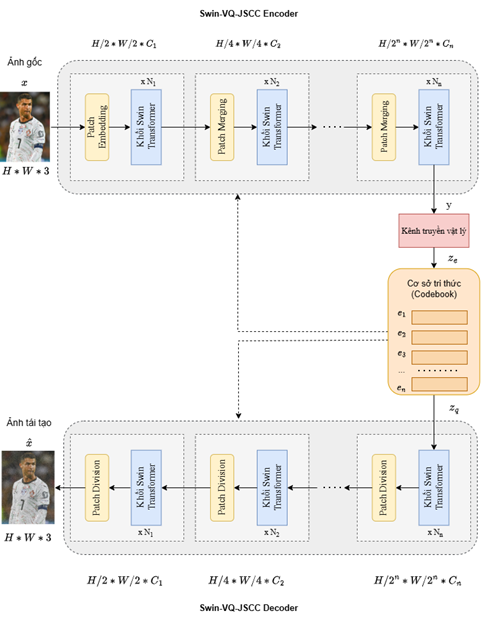

# Swin-VQ-JSCC

A semantic communication system for image transmission built on Swin Transformer with Vector Quantization-based Feature Codebook.

## Overview

Swin-VQ-JSCC is a Joint Source-Channel Coding (JSCC) model that integrates a Swin Transformer backbone with a discrete Feature Codebook via Vector Quantization. The codebook acts as a semantic denoiser at the receiver side — after the signal passes through the channel, noisy features are mapped to the nearest codebook entry before decoding, improving reconstruction quality especially under low bandwidth and high noise conditions.

This project is developed as part of an undergraduate thesis at VNU University of Engineering and Technology.

## Architecture

<div style="text-align: center;">
    
</div>

## Baselines

The model is benchmarked against the following methods:

| Model | Type | Credit |
|---|---|---|
| BPG + LDPC (BPSK / 4QAM / 64QAM) | SSCC | https://github.com/kmsiapps/Semantic-Communications-with-a-Vision-Transformer |
| DeepJSCC | JSCC | [Bourtsoulatze et al., 2019](https://arxiv.org/abs/1809.01733) |
| SwinJSCC | JSCC | [Li et al., 2023](https://arxiv.org/abs/2308.09361) |

## Installation

**Requirements:** Python 3.8.20, PyTorch 1.11. This project uses [uv](https://github.com/astral-sh/uv) for virtual environment management.

```bash
git clone https://github.com/HaruKatou/Swin-VQ-JSCC_implementation.git
cd Swin-VQ-JSCC_implementation
pip install -r requirements.txt
```

## Usage

### Model Variants

| Argument | Description |
|---|---|
| `SwinJSCC_w/o_SAandRA` | SwinJSCC — used as the JSCC baseline for comparisons |
| `SwinJSCC_vq-vae` | Swin-VQ-JSCC (proposed model) |
| `DeepJSCC` | DeepJSCC |

### Training

Swin-VQ-JSCC follows a two-stage training procedure. First, train the model without the Codebook. Then load that pre-trained checkpoint and train the full model with the Codebook.

**Swin-VQ-JSCC or SwinJSCC:**
```bash
uv run src/main.py \
  --training \
  --trainset CIFAR10 \
  --distortion-metric MSE \
  --model SwinJSCC_vq-vae \
  --channel-type awgn \
  --C 12 \
  --multiple-snr 10 \
```

**DeepJSCC:**
```bash
uv run evaluation/DJSCC_test.py \
  --training \
  --trainset CIFAR10 \
  --distortion-metric MSE \
  --channel-type awgn \
  --C 12 \
  --multiple-snr 10 \
```

### Key Arguments

| Argument | Description |
|---|---|
| `--model` | Model variant to use |
| `--C` | Bottleneck channel dimension (controls compression ratio) |
| `--multiple-snr` | SNR value(s) for training. Multiple values can be passed for evaluation |
| `--channel-type` | Channel type (`awgn`, etc.) |
| `--distortion-metric` | Distortion metric (`MSE`, etc.) |

## Results

Evaluation is performed on the CIFAR-10 dataset using PSNR and MS-SSIM metrics across different SNR levels and compression rates.